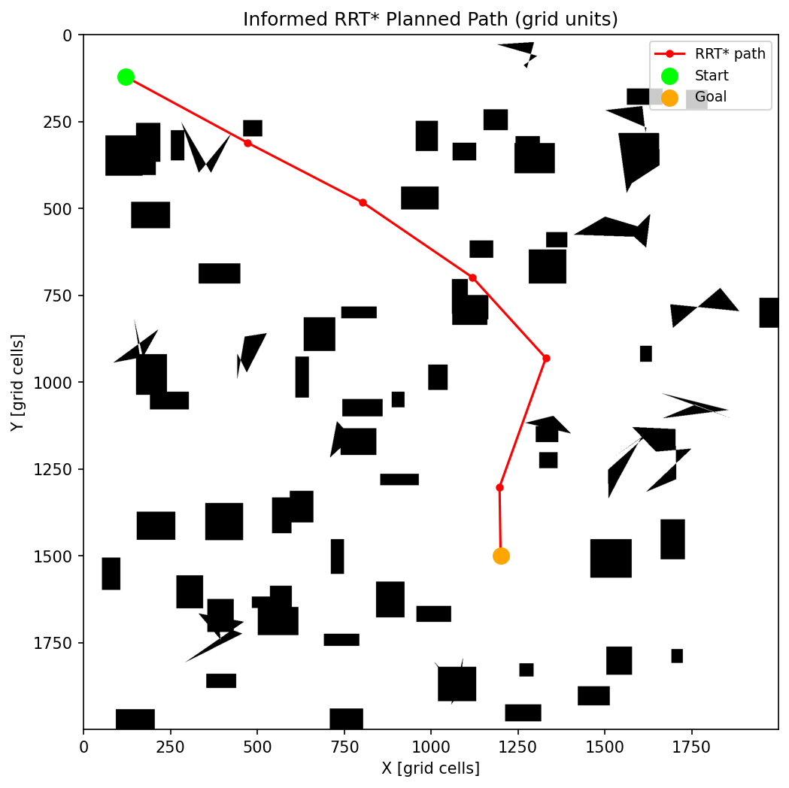
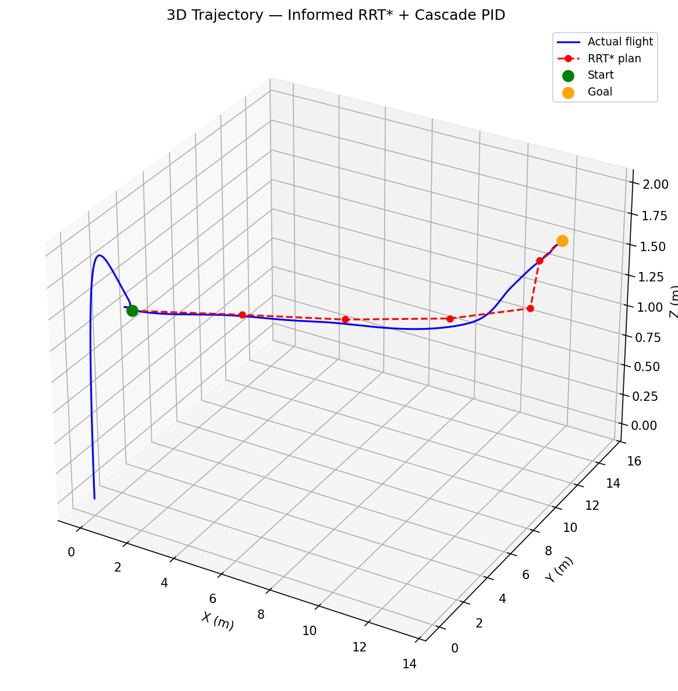
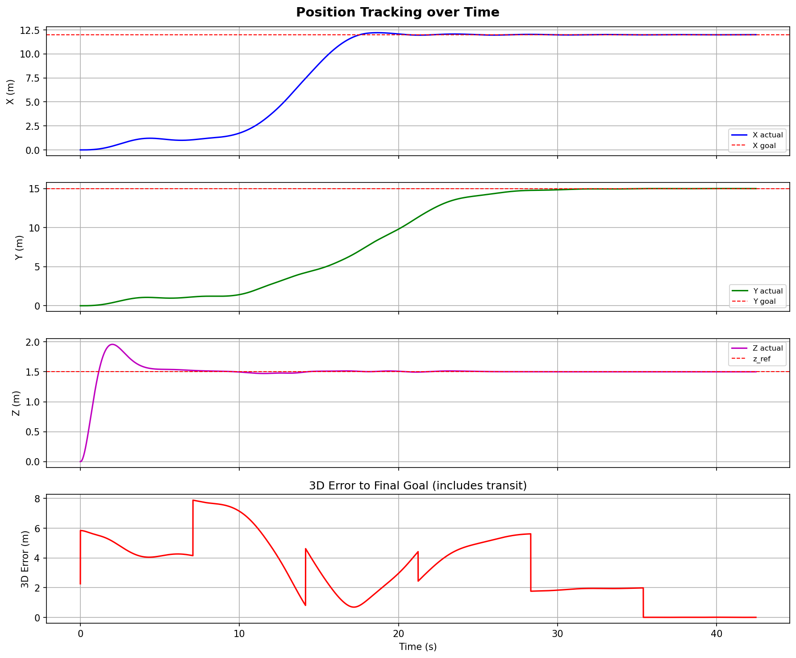
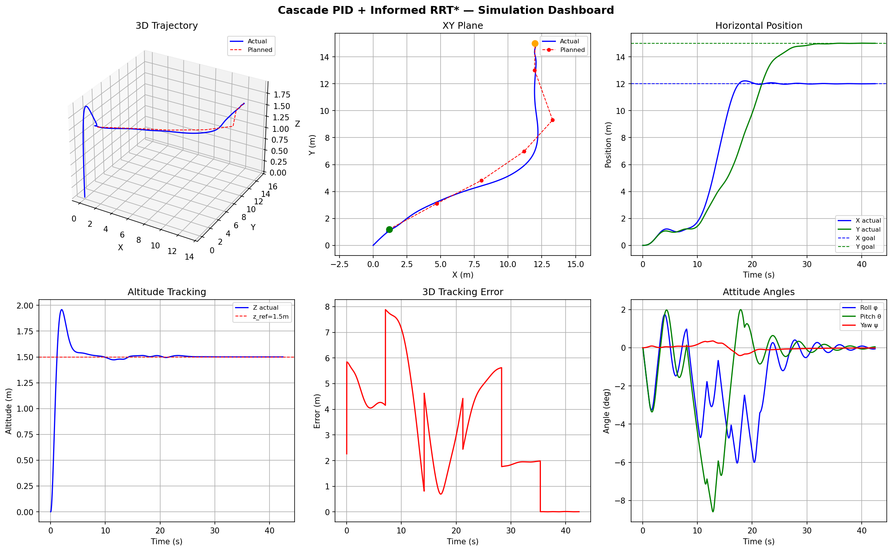

# Collision-Free Quadrotor Navigation: Informed RRT* + Cascade PID

A complete Plan-to-Track pipeline for quadrotor autonomous navigation.
Informed RRT* plans a collision-free path on a real 2000×2000 occupancy
grid; a 3-loop cascaded PID controller then tracks that path on a full
nonlinear 12-state dynamics model, achieving 1cm final position error
over a 20.63m obstacle-avoidance trajectory.

**Run:** `python run_simulations.py` — figures save to `simulations_output/` automatically.

---

## Results

| Metric | Value |
|--------|-------|
| Final 3D position error | **1 cm** |
| Altitude RMSE during cruise | **1.25 cm** |
| Hover RMSE after arrival | **13 cm** |
| Path length | **20.63 m** |
| Straight-line distance | 19.4 m |
| Path detour overhead | 6% |
| RRT* convergence | under 35 iterations |

---

## Visualizations

---

## Key Components

### Informed RRT* (`quad_utils.py`)
- Operates on a 2000×2000 occupancy grid (1 cell = 1 cm)
- After finding the first valid path, restricts random sampling to the improvement ellipse (start and goal as foci) — focuses iterations on path-length reduction rather than uninformative exploration
- Branch step size: 200 cells (2.0 m)
- Returns waypoints in ENU metres

### Cascaded PID Controller (`quad_utils.py`)
- **Outer loop (50 Hz)** — position error → desired roll/pitch angles + total thrust
- **Middle loop (100 Hz)** — desired angles → desired body rates
- **Inner loop (200 Hz)** — desired rates → torque commands (Tustin integrator, filtered derivative)
- Anti-windup on all integrators
- Velocity feedforward on horizontal axes

### Quadrotor Dynamics (`quad_utils.py`)
- Full 12-state model: position, velocity, Euler angles, body rates
- ENU inertial frame, ZYX Euler convention
- Gyroscopic coupling, aerodynamic drag, X-configuration motor layout
- Integrated with fixed-step RK4 at 200 Hz

### Waypoint Tracker (`quad_utils.py`)
- 3-phase finite state machine: takeoff / cruise / arrived
- Switches waypoint when drone enters switch radius (1.5 m)
- Computes velocity feedforward from current path segment direction

---

## Quadrotor Physical Parameters

| Parameter | Value |
|-----------|-------|
| Mass | 0.468 kg |
| Arm length | 0.225 m |
| Thrust coefficient kT | 2.98×10⁻⁶ N/(rad/s)² |
| Roll/Pitch inertia | 4.856×10⁻³ kg·m² |
| Yaw inertia | 8.801×10⁻³ kg·m² |

---

## Simulation Configuration

| Parameter | Value |
|-----------|-------|
| Master timestep dt | 5 ms (200 Hz) |
| Cruise altitude | 1.5 m |
| Waypoint switch radius | 1.5 m |
| Cruise speed (feedforward) | 0.7 m/s |
| Takeoff phase duration | 8.0 s |
| Grid scale | 1 cell = 1 cm |
| RRT* iterations | 800 |
| RRT* step size | 200 cells = 2.0 m |

---

## Output Figures

| Figure | Description |
|--------|-------------|
| `fig0_rrt_map.png` | Planned path overlaid on the occupancy grid |
| `fig1_3d_trajectory.png` | 3D actual vs planned trajectory |
| `fig2_position_vs_time.png` | X, Y, Z position and 3D error over time |
| `fig3_dashboard.png` | Full simulation dashboard (6 subplots) |

---

## Dependencies
numpy scipy matplotlib c4dynamics
